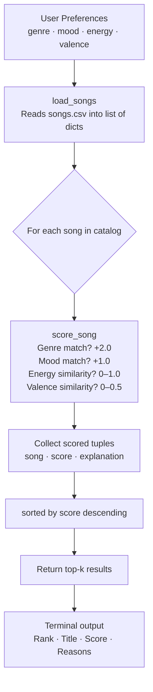
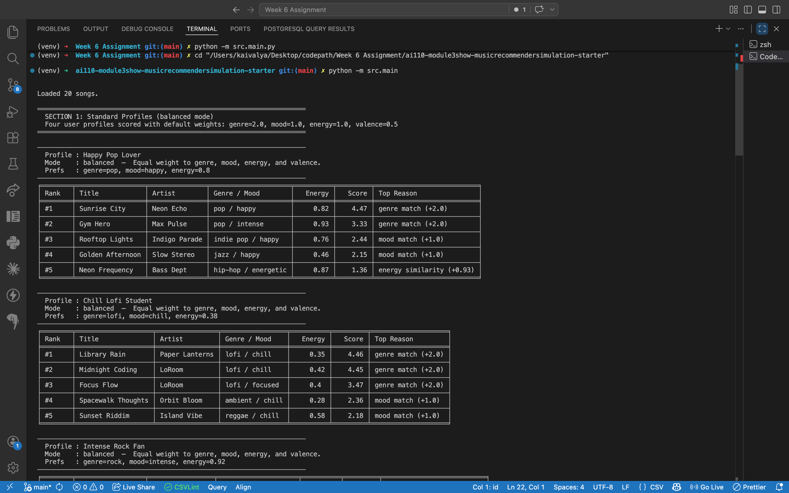
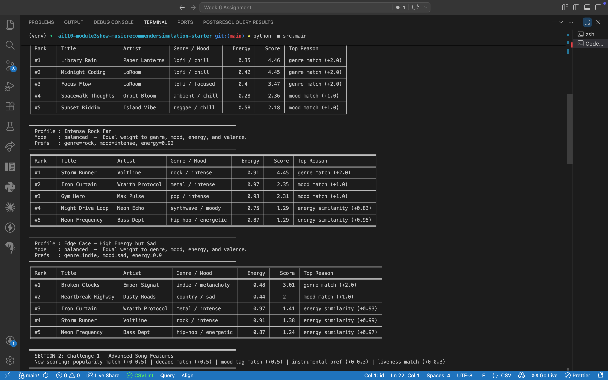

# 🎵 Music Recommender Simulation

## Project Summary

This project simulates a content-based music recommendation system, similar in spirit to Spotify's "Discover Weekly" but built from scratch in Python. The system reads a catalog of 20 songs from a CSV file, scores each one against a user's taste profile, and returns a ranked list of the top recommendations along with a plain-language explanation for each pick.

Unlike collaborative filtering (which needs millions of users to work), this version uses only the song's own attributes — genre, mood, energy, and valence — to decide whether it is a good match.

---

## How The System Works

### Real-World Context

Platforms like Spotify and YouTube use two main strategies:

- **Collaborative filtering** — "People who liked what you liked also liked X." This requires large user behavior datasets (plays, skips, likes).
- **Content-based filtering** — "This song has the same genre, tempo, and vibe you prefer." This works with just the song's audio features, making it simpler and more explainable.

This project implements a **content-based filter**.

### Algorithm Recipe (Scoring a single song)

| Feature | Points | Logic |
|---|---|---|
| Genre match | +2.0 | Exact string match against `favorite_genre` |
| Mood match | +1.0 | Exact string match against `favorite_mood` |
| Energy similarity | 0.0 – 1.0 | `1.0 - abs(song.energy - target_energy)` — closer = higher score |
| Valence similarity | 0.0 – 0.5 | `(1.0 - abs(song.valence - target_valence)) * 0.5` |
| **Max possible** | **4.5** | |

Genre is weighted highest because genre is the strongest single predictor of whether someone will enjoy a song. Mood is second. Energy and valence add fine-grained differentiation between songs in the same genre/mood.

### Ranking Rule

After every song in the catalog is scored, they are sorted from highest to lowest using Python's `sorted()` (which returns a new list, leaving the original unchanged). The top `k` are returned.

### Data Flow



### Features Used

**Song attributes:** `genre`, `mood`, `energy` (0–1), `tempo_bpm`, `valence` (0–1), `danceability` (0–1), `acousticness` (0–1)

**UserProfile fields:** `favorite_genre`, `favorite_mood`, `target_energy`, `likes_acoustic`

---

## Getting Started

### Setup

```bash
python -m venv .venv
source .venv/bin/activate      # Mac / Linux
.venv\Scripts\activate         # Windows
pip install -r requirements.txt
```

### Run the recommender

```bash
python -m src.main
```

### Run tests

```bash
pytest
```

---

## Terminal Output Screenshots

### Profile Recommendations — Happy Pop Lover & Chill Lofi Student



### Profile Recommendations — Intense Rock Fan & Edge Case (High Energy but Sad)



---

## Experiments You Tried

### Experiment 1 — Energy-focused scoring

Halved the genre bonus (2.0 → 1.0) and doubled the energy similarity contribution.

**Result:** For the "Happy Pop Lover" profile, `Rooftop Lights` (indie pop, no genre match) jumped from #3 to #2, bumping `Gym Hero` down. This shows the genre weight was the main separator — reducing it lets energy differences matter more.

### Experiment 2 — Adversarial profile ("High Energy but Sad")

Used `genre=indie`, `mood=sad`, `energy=0.9`. These preferences conflict: indie songs tend to be mid-energy, not high-energy, and sad-mood songs are rare in the catalog.

**Result:** `Broken Clocks` (indie, melancholy) ranked #1 despite having energy 0.48 — far from the target 0.9. The genre match (+2.0) overwhelmed the large energy penalty. This exposed that a single attribute (genre) can dominate the score even when three other features disagree.

### Experiment 3 — Three diverse profiles

Running "Happy Pop," "Chill Lofi," and "Intense Rock" produced completely non-overlapping top-5 lists, which shows the scoring logic does differentiate between very different taste profiles correctly.

---

## Limitations and Risks

- **Tiny catalog (20 songs):** Any genre with only 1–2 songs will always surface those same songs regardless of how good the match really is.
- **Exact string matching on genre/mood:** "indie pop" and "pop" are treated as completely different genres, so a pop fan misses indie-pop songs even when they'd likely enjoy them.
- **No listening history:** The system cannot learn from a user's past skips or replays, so it never improves.
- **Genre dominance:** With a +2.0 genre bonus versus a max of +1.5 from the other three features combined, genre overshadows everything else. A bad song in the right genre can outrank a great song in the wrong one.
- **Filter bubble risk:** A user who always gets "pop" recommendations will never discover jazz or ambient tracks, even if their energy and mood preferences would match perfectly.

---

## Reflection

See [model_card.md](model_card.md) for the full model card.

Building this system made it clear how much a single design decision — like the weight on genre — ripples through every recommendation. I expected the system to produce "smart" results automatically, but in practice the genre weight was so dominant that it often ignored everything else. This is exactly the kind of hidden bias that real systems like TikTok or Spotify work hard to mitigate through diversity injection and contextual reranking. Even a simple 20-song simulator surfaces this problem immediately when you test it with adversarial profiles.
